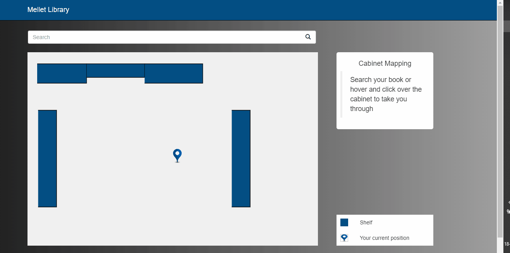

# Floor Mapping of the University Library

This is a visualization project of the floor mapping of the library.
The data is fed into the app in JSON format, which defines the coordinates of the objects, shelves, furnitures etc.
The coordinates are normalized wrt the dimension of the building.
It is very much similar to GeoJSON formatting.
The books are searched and the map is drawn denoting the current location of the user and the location of the book found.

The json data is then parsed and the objects are rendered on HTML canvas, as a map to locate shelves and books.
Also, A similar visualization technique is used to search and locate the book on each cabinet.
The backend API runs in Django Python.
Client communicates the server for each request when the book is searches, and the resulting coordinates are fetched and rendered in the canvas.

Demo:

